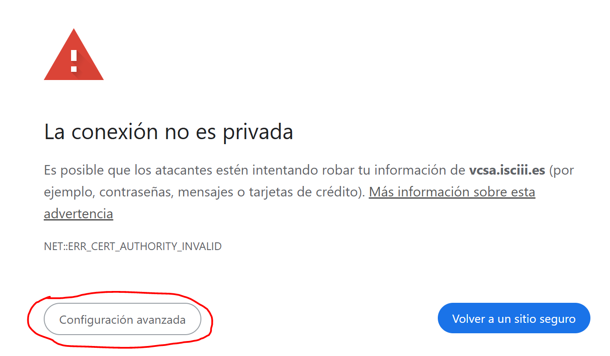

## Bacterial WGS training : Exercise 0

<div class="tables-start"></div>

|**Title**| Working environment setup.|
|---------|-------------------------------------------|
|**Training dataset:**|
|**Questions:**| <ul><li> Connect to VCenter</li><li>Copy course data</li></ul>|
|**Objectives**:|<ul><li>In this document we will cover the working environment setup for the exercises.</li></ul>|
|**Time estimation**:| 5 min |
|**Key points**:|<ul><li>Each practical is designed to work on specific folder structure, so make sure you follow these steps correctly.</li></ul>|

<div class="tables-end"></div>

#### IMPORTANT: Make sure you understand and execute these commands in the right order.

FOLLOW [THESE STEPS](../slides/tutorial_access_VirtualMachine.pdf):

Summarized is:

In your computer:

- Open in your internet browser this URL: [https://vcsa.isciii.es/](https://vcsa.isciii.es/).
- Configuración avanzada > Acceder a vcsa.isciii.es (sitio no seguro)


- Go to `Iniciar VSPHERE CLIENT (HTML5)`
- Then type your ISCIII e-mail and password.
- Select your working machine (e.g. bioinfo01) in the left pannel
- Click on `INICIAR REMOTE CONSOLE`

In the remote console:

- Now click on your user: alumno, and type the password we will tell you.
- There, open a firefox window and open this tutorial again by:
  - Google: BU-ISCIII github
  - Select `bacterial_wgs_training`
  - Exercise0.


Now you are here again!

Open a new terminal (ctrl+alt+t) and navigate to your home directory if you are not already there:

```bash
pwd
cd
pwd
#Output: /home/alumno
```

Create the project folder for the practises of the course:

```bash
mkdir -p wgs
```

Navigate to the directory:

```bash
cd wgs
```

Download git repository:

```bash
git clone https://github.com/BU-ISCIII/bacterial_wgs_training.git
```

Download training dataset:

```bash
cp -r /mnt/ngs_course_shared/bacterial_wgs_training_dataset .
```

Check that everything is correct:

```bash
ls
#Output: bacterial_wgs_training  bacterial_wgs_training_dataset
pwd
#Output: /home/alumno/wgs
```
