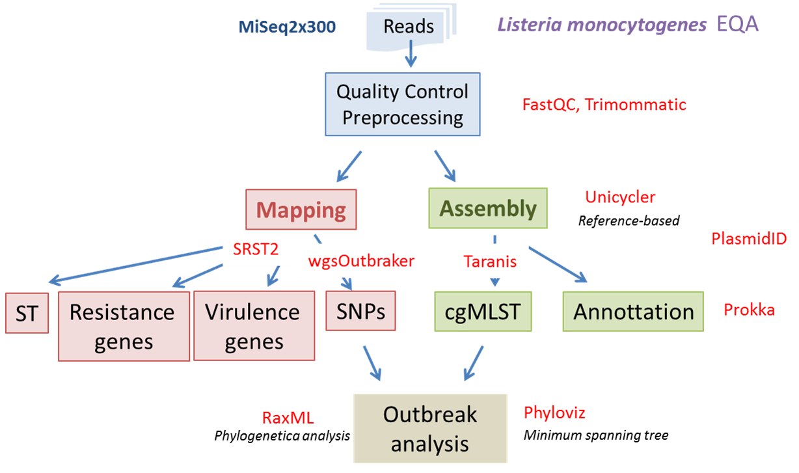
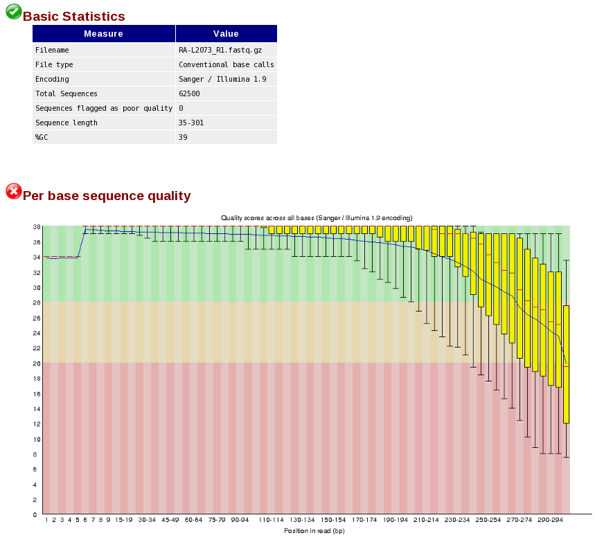
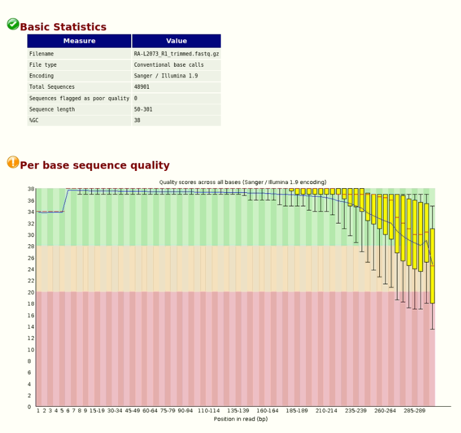
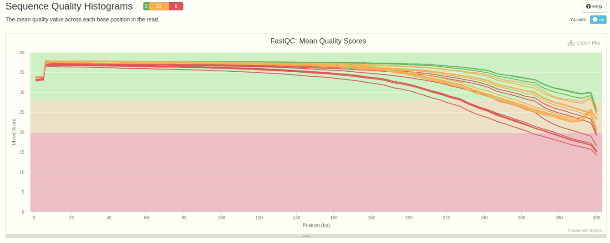
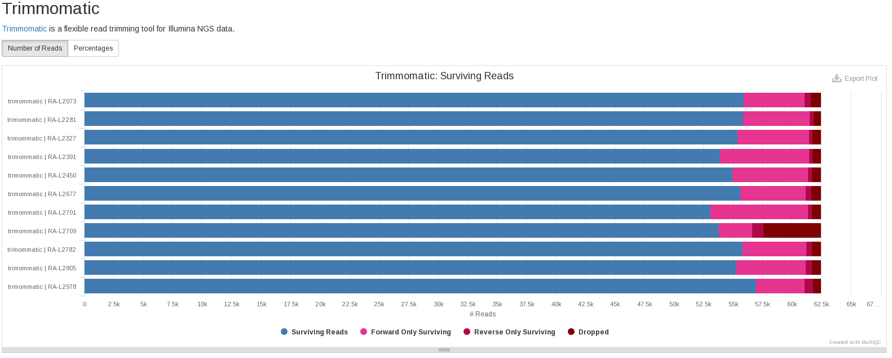
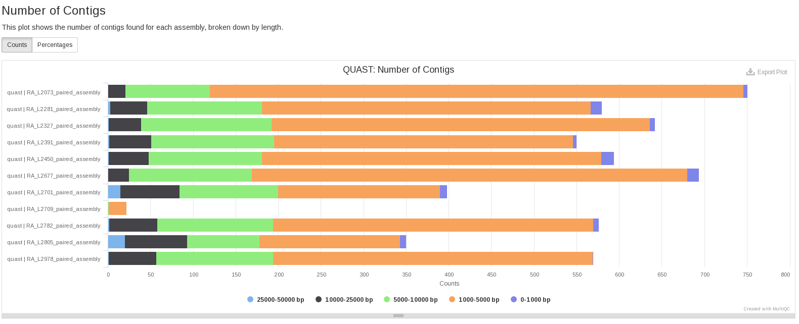
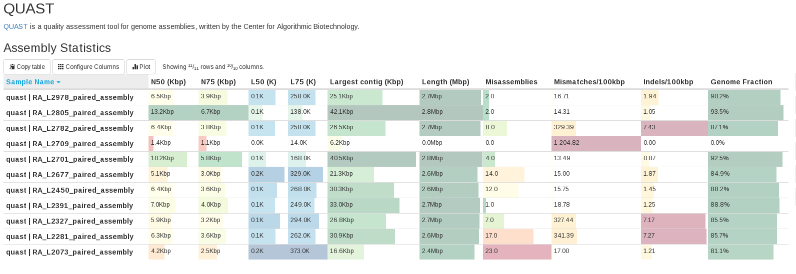
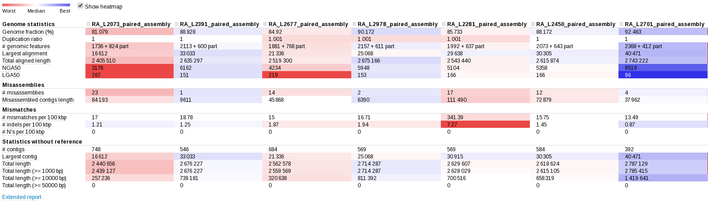
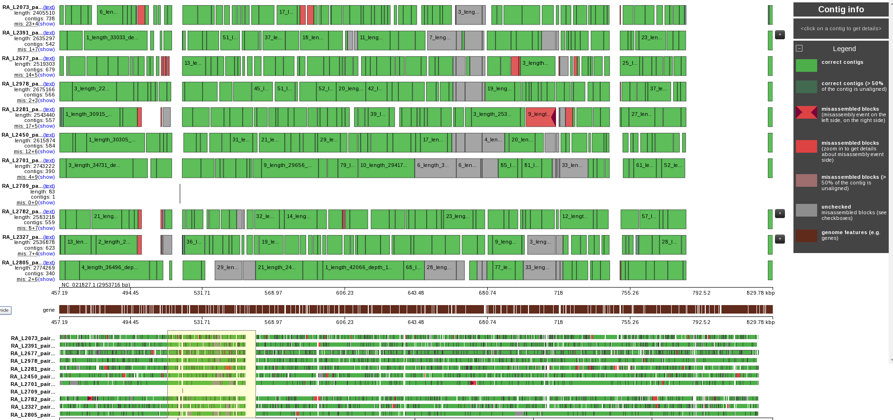

## Bacterial WGS training : Exercise 2

<div class="tables-start"></div>

|**Title**| Sequence quality and assambly.|
|---------|-------------------------------------------|
|**Training dataset:**|
|**Questions:**| <ul><li>How do I know if my data was correctly sequenced?</li><li>How can I improve my data quality?</li><li>How do I assamble the reads?</li><li>How do I know if my reads were correctly assembled</li></ul>|
|**Objectives**:|<ul><li>Check quality of sequenced data.</li><li>Trimm low quality segments and adapters.</li><li>Assamble mapped reads.</li></ul>|
|**Time estimation**:| 1 h 30 min |
|**Key points**:|<ul><li>Analysis of sequence quality.</li><li>Assembly.</li></ul>|

- [Introduction](#introduction)
- [Exercise](#exercise)
    - [Preprocessing](#preprocessing)
    - [Assembly](#assembly)

<div class="tables-end"></div>

## Introduction
### Training summary

<p align="center"></p>

### Training dataset description
This dataset was used for [external quality assessment (EQA-5)](https://ecdc.europa.eu/en/publications-data/fifth-external-quality-assessment-scheme-listeria-monocytogenes-typing) scheme for typing of
Listeria monocytogenes (*L. monocytogenes*) organised for laboratories providing data to the Food and Waterborne
Diseases and Zoonoses Network (FWD-Net) managed by ECDC. Since 2012, the Section for Foodborne Infections
at the Statens Serum Institut (SSI) in Denmark has arranged this EQA under a framework contract with ECDC. The
EQA-5 contain serotyping and molecular typing-based cluster analysis.

Human listeriosis is a relatively rare but serious zoonotic disease with an EU notification rate of 0.47 cases per 100
000 population in 2016. The number of human listeriosis cases in the EU has increased since 2008, with the
highest annual number of deaths since 2009 reported in 2015 at 270.

The objectives of the EQA are to assess the quality and comparability of the typing data reported by public health
national reference laboratories participating in FWD-Net. Test isolates for the EQA were selected to cover isolates
currently relevant to public health in Europe and represent a broad range of clinically relevant types for invasive
listeriosis. Two separate sets of 11 test isolates were selected for serotyping and molecular typing-based cluster
analysis. The expected cluster was based on a pre-defined categorisation by the organiser.
Twenty-two *L. monocytogenes* test isolates were selected to fulfil the following criteria:
- cover a broad range of the common clinically relevant types for invasive listeriosis
- include closely related isolates
- remain stable during the preliminary test period at the organising laboratory.

The 11 test isolates for cluster analysis were selected to include isolates with different or varying relatedness isolates and different multi locus sequence types.


### How do I know if my data was correctly sequenced?

Despite the improvement of sequencing methods, there is no error-free technique. The Phred quality score [(Ewing et al., 1998)](https://www.ncbi.nlm.nih.gov/pubmed/9521921) has been used since the late 90s as a measure of the quality of each sequenced nucleotide. Phred quality scores not only allow us to determine the accuracy of sequencing and of each individual position in an assembled consensus sequence, but it is also used to compare the efficiency of the sequencing methods.

Phred quality scores Q are defined as a property which is logarithmically related to the base-calling error probabilities P . The Phred quality score is the negative ratio of the error probability to the reference level of P = 1 expressed in Decibel (dB):

<p align="center">𝑄 = −10 log<sub>10</sub> P</p>

A correct measuring of the sequencing quality is essential for identifying problems in the sequencing and removal of low-quality sequences or sub sequences. Conversion of typical Phred scores used for quality thresholds into accuracy can be ead in the following table:

|**Phred score**| Error probability | Accuracy|
|----------------|--------------------|---------|
|10|1/10|90%|
|20|1/100|99%|
|30|1/1000|99.9%|
|40|1/10000|99.99%|
|50|1/100000|99.999%|
|60|1/1000000|99.99999%|

There are multiple software to read and generate statistics to help with the interpretation of the quality of a sequence. One of the most commonly used methods for this task is [FastQC](https://www.bioinformatics.babraham.ac.uk/projects/fastqc/) (Andrews, 2010), a java program that run on any system and has both command line and graphic interface.

<p align="center"></p>
<br>

FastQC aims to provide a simple way to do some quality control checks on raw sequence data coming from high throughput sequencing. It provides a modular set of analyses which you can use to give a quick impression of whether your data has any problems of which you should be aware before doing any further analysis. Here you can compare examples of a [good sequencing output](https://www.bioinformatics.babraham.ac.uk/projects/fastqc/good_sequence_short_fastqc.html) and a [bad one](https://www.bioinformatics.babraham.ac.uk/projects/fastqc/bad_sequence_fastqc.html).


### How can I improve my data quality?

Most modern aligners can filter out low quality reads and clip off low quality ends and adapters. In case it has to be done manually, because the sequencing was poor but you still need to use that data or because you want to have more control on the trimming of reads or use a particular method, there are standalone applications that allow you to do it. [Trimmomatic](http://www.usadellab.org/cms/?page=trimmomatic) (Bolger, Lohse, & Usadel, 2014) is one of the most broadly used along with [fastp](https://bioinformaticshome.com/tools/rna-seq/descriptions/fastp.html) (Chen S. et al, 2018). Fastp is the one we will use in the training . It is written in C++, has multi-threading support and performs a variety of useful trimming tasks for illumina paired-end and single ended data.

Common trimming includes removal of short reads, and cut off adapters and a number of bases, if below a threshold quality. Modern algorithms also include more complex methods, as the sliding window trimming. This is the method we will use in the exercises, and it allows to trimm a variable number of bases in each read, cutting once the average quality within the window falls below a threshold.

### De novo or reference-based assembly?

After preprocessing, the next step is aligning the reads to rebuild the genomic sequence. There are two main ways of doing this:


- Reference-based assembly

    For each of the short reads in the FASTQ file, a corresponding location in the reference sequence is determined. A mapping algorithm will locate a location in the reference sequence that matches the read, while tolerating a certain amount of mismatch to allow subsequence variation detection tath correspond to the actual difference between the reference and de assembled genome.

- *De novo* assembly

    *De novo* genome assembly consists in taking a collection of short sequencing reads and reconstruct the genome sequence, source of all these fragments.The output of an assembler is decomposed into contigs: contiguous regions of the genome which are resolved, and/or scaffolds: longer sequences formed by reordered and oriented contigs with positional information but without sequence resolution.


## Exercise

### Preprocessing

As we have seen in the introduction, the first step is to know the quality of our sequences. Those with an unnaceptable quality will be trimmed in order to remove the nucleotides with bad quality to ease future analysis algorithms such assembly.
In order to check quality and trim the reads wee have to execute this command:

------

```Bash
cd
pwd
#Output: /home/alumno
cd wgs/bacterial_wgs_training_dataset/ANALYSIS/
pwd
#Output: /home/alumno/wgs/bacterial_wgs_training_dataset/ANALYSIS/
ls
#Output: 01-handsonlinux
```

Now we only have the folder from the first day of training. And here in `ANALYSIS` folder is where we will run the nextflow.
First we activate the nextflow conda environment
```
conda activate nextflow
```

An now run the main nextflow command for pre-processing

```
nextflow run ../../bacterial_wgs_training/main.nf
  --reads '../RAW/DOWNSAMPLED/*_R{1,2}.fastq.gz' \
  -profile conda \
  --fasta ../REFERENCES/listeria_NC_021827.1_NoPhagues.fna \
  --step preprocessing  \
  --outdir 02-assembly
```
------


This execution runs internally three programs: FastQC, fastp and MultiQC as follow:

For each sample those command are executed:
- `fastqc reads_R1.fastq.gz reads_R2.fastq.gz`
    - reads_R1.fastq.gz and reads_R2.fastq.gz are the input Illumina reads which quality is analyzed
- `fastp --in1 reads_R1.fastq.gz --in1 reads_R2.fastq.gz 
--out1 reads_trimmed_R1.fastq --out2 reads_trimmed_R2.fastq 
--unpaired1 reads_unpaired_R1.fastq --unpaired2 reads_unpaired_R2.fastq 
 --detect_adapter_for_pe 
--cut_front 
--cut_tail 
--cut_mean_quality 20 
--qualified_quality_phred 20 
--unqualified_percent_limit 10 
--length_required 50 
--trim_poly_x 
--thread 1 
--json sample.fastp.json 
--html sample.fastp.html 
2> sample.fastp.log`
    - reads_R1.fastq.gz and reads_R2.fastq.gz are the input Illumina reads which will be trimmed
    - reads_trimmed_R[1|2].fastq reads_fail_R[1|2].fastq
        - trimmed refer to sequences trimmed that passed the quality filter for both R1 and R2
        - fail refer to sequences that did not pass the quality filter
    - detect_adapter_for_pe: Detects automatically adapters for pair-end data
    - cut_front and cut_tail: remove bases with low quality from 5' to tail and 3' to front respectively using a sliding window.
    - cut_mean_quality: mean quality requirement for cut_front and cut_tail. The bases in the sliding window with mean quality below 20 will be cut.
    - qualified_quality_phred: The quality value that a base is qualified. Bases below 20Q Phred are unqualified.
    - unqualified_percent_limit: How many percents of bases are allowed to be unqualified. Maximum 10% of bases can be unqualified.
    - length_required: reads shorter than 50 will be discarded
    - trim_poly_x: enable polyX trimming in 3' ends.

- `fastqc reads_trimmed_R[1|2].fastq reads_fail_R[1|2].fastq`
    - reads_trimmed_R[1|2].fastq reads_fail_R[1|2].fastq are sequences after trimming step which quality will be assesed

- `multiqc RESULTS_DIRECTORY`
    - MultiQC will automatically search for raw and trimmed reads quality results and will compare them in user-friendly graphs

#### Final results should look like those:

| Before trimming |After trimming |
| --- | --- |
|  |  |

Here we can see the quality of the R1 reads before and after trimming

<p align="center"></p>
This is the MultiQC output comparing the quality of trimmed and raw reads
<br>
<br>

<!---
<p align="center"></p>
This is the MultiQC output sumarizing reads that have been filtered after trimming step
<br>
<br>-->


### Assembly

Reconstruct the source genome is a mandatory step for latter analysis such annotation, comparative analysis and cgMLST. In order to assemble all samples we need to run this command:

------
First check that you are in the correct folder:

```Bash
pwd
cd
pwd
#Output: /home/alumno
cd wgs/bacterial_wgs_training_dataset/ANALYSIS/
pwd
#Output: /home/alumno/wgs/bacterial_wgs_training_dataset/ANALYSIS/
ls
#Output: 01-handsonlinux 02-assembly work
```

Now we can run the assembly process

```
nextflow run ../../bacterial_wgs_training/main.nf \
  -resume \
  -profile conda \
  --reads '../RAW/DOWNSAMPLED/*_R{1,2}.fastq.gz' \
  --fasta ../REFERENCES/listeria_NC_021827.1_NoPhagues.fna \
  --gtf ../REFERENCES/listeria_NC_021827.1_NoPhagues.gff \
  --step assembly \
  --outdir 02-assembly
```

------

This execution runs internally four programs: FastQC, fastp, __Unicycler__ , MultiQC and Quast:

Software for preprocessing are executed as noted before. This step includes an aditional assembly process that uses [Unicycler](https://github.com/rrwick/Unicycler) to assemble all samples. Nextflow runs Unicycler for each sample as follow:

`unicycler -1 reads_R1.fastq.gz -2 reads_R2.fastq.gz`

Once assembled, the file containing the contigs (SAMPLE_paired_assembly.fasta) will be checked by [Quast](http://quast.sourceforge.net/quast), using a [reference fasta and gff](https://www.ncbi.nlm.nih.gov/nuccore/NC_021827) from *Listeria monocytogenes* strain J1817. Quast was executed as follow:

`quast.py -R reference.fasta -G reference_genes.gff *_paired_assembly.fasta`

    - R is the fasta file with the reference sequence
    - G refers to the gff file for the same sequence
    - All sequences are used as input with a wildcard that includes all fasta files with assembled contigs


#### Final results should look like those:

<p align="center"></p>
This is the MultiQC output sumarizing the number of contigs assembled for each sample, sorting them by size
<br>
<br>

<p align="center"></p>
This is the MultiQC output sumarizing basic assembly statistics for each sample
<br>
<br>

<p align="center"></p>
This is the Quast output sumarizing all detailed assembly statistics, comparing all the assemblies in one table
<br>
<br>

<p align="center"></p>
This is Quast Icarus viewer where contigs are aligned to the reference supplied in order to check how similar the assembled contigs are to the genome from the database.
<br>
<br>
