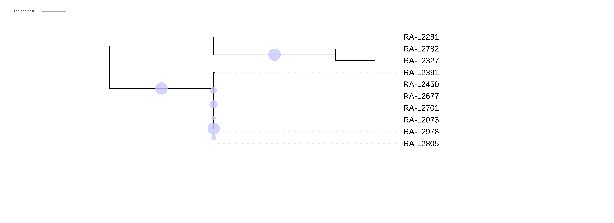

# Bacterial WGS training : Exercise 3

<div class="tables-start"></div>

|**Title**| SNP-based bacterial outbreak investigation.|
|---------|-------------------------------------------|
|**Training dataset:**|                                |
|**Questions:**| <ul><li>Do I have the needed depth of coverage?</li><li>Have I chosen the correct reference?</li><li>How do I create a SNP matrix? How many SNPs do I have?</li><li>How can I visualize my phylogenetic tree? Which problems can I encounter?</li><li>Which strains belong to the outbreak?</li></ul>|
|**Objectives**:|<ul><li>Trimming and quality control of raw reads.</li><li>Mapping against genome reference and duplicate filter.</li><li>Variant Calling.</li><li>SNP matrix creation.</li><li>Maximum Likelihood phylogeny.</li><li>Visualization of results.</li></ul>|
|**Time estimation**:| 1 h|
|**Key points**:|<ul><li>Importance of reference selecion in SNP-based tipification.</li><li>Variant calling and SNP reconstruction is a key step in the process.</li><li>Interpretation of results is case, species and epidemiology dependant.</li></ul>|

<div class="tables-end"></div>

## Introduction
Although scientific community efforts have been focused on assembly-based methods and the optimization of reconstructing complete genomes, variant calling is a essential procedure that allows per base comparison between different genomes ([Olson et al 2015](https://www.frontiersin.org/articles/10.3389/fgene.2015.00235/full)).

SNP-based strain typing using WGS can be performed via reference-based mapping of either reads or assembled contigs. There are many available microbial SNP pipelines, such as [Snippy](https://github.com/tseemann/snippy), [NASP](https://github.com/TGenNorth/NASP), [SNVphyl](https://snvphyl.readthedocs.io/en/latest/), [CFSAN SNP Pipeline](https://github.com/CFSAN-Biostatistics/snp-pipeline), or [Lyve-SET](https://github.com/lskatz/lyve-SET).

Variant calling is a process with a bunch of potential error sources that may lead to incorrect variant calls. Identifying and resolving this incorrect calls is critical for bacterial genomics to advance. In this exercise we will use WGS-Outbreaker a SNP-based tool developed by BU-ISCIII that uses bwa mapper, GATK variant caller and several SNP-filtering steps for SNP matrix contruction following maximun likelihood phylogeny using RAxML. Next image resumes the steps we are going to execute:

<p align="center"></p>

## Preprocessing
We have already done our data prerpocesing in the [previous exercise](https://github.com/BU-ISCIII/bacterial_wgs_training/blob/master/exercises/02_QualityAndAssembly.md#exercise). If you remember, we executed a nextflow order which trimmed our raw reads and reutned a quality report for both pre- and post-trimming files. We used FastQC for checking the data quality, Trimmomatic for the trimming and MultiQC for building the statitstics report.

For mapping our reads, we will need to preprocess our data in the same way as we did for the assembly. As the results will be exactly the same we reviewed in that exercise, we will not spend more time and will move to exiting new topics.

## Mapping
In the previous lecture we covered how to assamble the reads in the fastq file to recreate the original genome, or at least contigs of it. This technique requieres high sequence coverage, high read lenght reads and good read quality, plus being highly computationally demanding. This means that it is an expensive and slow method, plus having one big dissavantage when trying to compare assambled genomes: different algorithms (and even different versions of the same software) may produce different assambles from the same input.

For this reason, when the objective is to compare genomes of different samples, we use another method for rebuilding the genome called mapping. This technique consists in using a previously assembled genome as reference against which sequenced reads will be independently aligned against. Every read will be placed in the most likely position, ignoring any synergies between reads. This produces genomes with the same structure and coordinates that can be easily compared.

There are multiple mapping algorithms and softwares, but for this exercise we will use only [bwa](http://bio-bwa.sourceforge.net/) ([H. Li and R. Durbin, 2010](https://www.ncbi.nlm.nih.gov/pubmed/20080505)). bwa is implements a backward search with Burrows-Wheeler Transform to efficiently align short sequencing reads against a large reference sequence such as the human genome, allowing mismatches and gaps. For longer reads, it combines its algorthm with a modified Smith-Waterman's alignment, achieving the same results as the starndard algorithm but thousands of times faster. While still slower than BLAST for long query sequences, it is able to find all matches without heuristics, which makes it able to detect chimeras potentially caused by structural variations or reference misassemblies.

To map our samples with bwa, we only have to execute this command:
```
cd
cd wgs/bacterial_wgs_training_dataset/ANALYSIS
nextflow run ../../bacterial_wgs_training/main.nf \
  -profile conda \
  --reads '../RAW/DOWNSAMPLED/*_R{1,2}.fastq.gz' \
  --fasta '../REFERENCES/listeria_NC_021827.1_NoPhagues.fna' \
  --outdir 03-mapping \
  --step mapping \
  -resume
```

This command will internally execute the following programs with our samples:
 1. **Preprocessing**
Quality control and read trimming with FastQC and Trimmomatic, as used in the previous exercise.

2. **Building bwa index**
Bwa needs to build an index from the reference genome in order to now how to map the reads. This type of algorithms allows the software to do very fast searches on the genome.
```
bwa index fasta_file
```
3. **Mapping**
Map each read against the reference genome using bwa mem software.
```
bwa mem fasta reads | samtools view -bT fasta - > bam
```
4. **Post-processing and statistics**
A handful of steps have to be executed before using the bam files resulting from the mapping.
First, bam files have to be sorted and indexed:
```
samtools sort bam -o sorted.bam
samtools index sorted.bam
```
This step allows first to reduce file size due to the compression algorithm used to generate bam files it works better if the file is sorted, and second with the file sorted and the index generated searches in the file are way faster. Imagine to look for something in a book with the pages unordered and without an index, difficult right?

Next mapping stats generated:
```
samtools stats sorted.bam > stats.txt
```
And finally we can remove some sequencing and mapping artifacts, as the duplicated reads:
```
picard MarkDuplicates \
	INPUT=sorted.bam \
	OUTPUT=dedup.bam \
	ASSUME_SORTED=true \
	REMOVE_DUPLICATES=true \
	METRICS_FILE=picardDupMetrics.txt \
	VALIDATION_STRINGENCY=LENIENT \
```
Parameters explanation:
- ASSUME_SORTED: TRUE or FALSE. Is the bam file sorted or not?
- REMOVE_DUPLICATES: TRUE or FALSE. Do we want to remove duplicates from our bam file or do we want to just mark them?
- METRICS_FILE: where do we want to save the metrics file?
- VALIDATION_STRINGENCY = SILENT, LENIENT or STRICT. If an error comes out how the software is going to behave. SILENT the software just ignores the error and does not output anything, LENIENT it continous to run but outputs an error and STRICT the software stops when it encounters any error (this last option can be pretty annoying).

4. **MultiQC report**
MultiQC will automatically search for the stats files and will compare them in user-friendly graphs
```
multiqc RESULTS_DIRECTORY
```
Finally, we have our mapped genomes. Now we can open them with IGV to see how they have mapped against the reference genome, and which variants are.

## Mapping stats
The mapping stats are saved in `results/bwa/stats/`, where you can find a stats file per mapped sample.

We are going to visualize the summary statistics of the mapping step with MultiQC:

* The stats are represented in "Alignment metrics":


* The percentage of mapped reads per sample are plotted in "Percent Mapped":


* The number of duplicated reads per sample are plotted in "Mark Duplicates":


## Visualizing your mapping
In order to visualize our mapping we will use IGV (Integrative Genomics Viewer). This is an open source and freely available lightweight visualization tool that enables intuitive real-time exploration of diverse, large-scale genomic data sets on standard desktop computers. It supports flexible integration of a wide range of genomic data types including aligned sequence reads, mutations, copy number, RNA interference screens, gene expression, methylation and genomic annotations.

Navigation through a data set is similar to that of Google Maps, allowing the user to zoom and pan seamlessly across the genome at any level of detail from whole genome to base pair. Data sets can be loaded from local or remote sources, including cloud-based resources, enabling investigators to view their own genomic data sets alongside publicly available data.

Let's launch IGV! Navigate to your desktop and find the icon we have left for you. Double click on it and wait until it finishes loading.


First we have to load the reference genome. Click on "Genomes" and "Load Genome from File...", navigate to our training_dataset folder and select the reference genome "listeria_NC_021827.1_NoPhagues.fna".

Now, load our mapped genomes by clicking on "File" and "load from File...", navigate to our mapped genomes (HINT: they are in the shared folder inside the "results/picard" folder), and load one of them:


Finally, we can load as many as we want (or as many as the virtual machine survives) to compare them:


## Variant Calling

We are using snippy as the main software for variant calling, SNP-matrix creation and phylogeny performance. Following the development of the former exercises we are using nextflow, in this case using `outbreakSNP` step.
This step includes the following processes:
- Preprocessing:
    - Trimming with fastp software.
    - Quality control with fastQC.
- Snippy software:
    - Mapping with bwa.
    - Variant calling with freebayes.
    - SNP-Matrix creation.
    - SNP-core-filtering
- Phylogeny with IQ-tree

Everything clear..? So let's run it.

### Run the exercise

First of all we need to be clear in which folder we are. We need to be in our working directory `/home/alumno/Documents/wgs` and our training dataset downloaded the first day must be there (If you had any problem the previous sessions please refere to the [setup tutorial](00_SetUp.md)).

You can run this command to check where you are:
```Bash
pwd
```
Output:
```
/home/alumno/Documents/wgs/bacterial_training_dataset/ANALYSIS
```
And this one to list all the files in your working directory. Check there is the training_dataset folder and the results folder from previous sessions.
```Bash
ls
```
Output:
```
01-handsonLinux 02-assembly work
```

Once our localization is correct we will launch nextflow with the next parameters:
  - Raw reads
  - step outbreakSNP
  - saveTrimmed -> this parameters saves the fastq files trimmed in our results dir.
  - outbreaker_config <- config file with all the parameters required by WGS-Outbreaker

```Bash
nextflow run ../../bacterial_wgs_training/main.nf \
  -profile conda \
  --reads '../RAW/FULL_DATASET/*_R{1,2}.fastq.gz' \
  --fasta ../REFERENCES/listeria_NC_021827.1_NoPhagues.fna \
  --step outbreakSNP \
  --outdir 04-outbreakSNP \
  -resume
```

>This will take a while so we need to move forward and understand what we are doing and learn how to see and interpret our results.

### Results analysis
Let's proceed to analyze the results. We can find them in:

```
/home/alumno/wgs/bacterial_wgs_training_dataset/RESULTS/04-outbreakSNP
```

This directory contains several folders including:

```

```

Since alignment and quality control results has been previously addresed in this course (see [02_QualityAndAssembly.md](02_QualityAndAssembly.md) and [Mapping Section](#Mapping)), we will proceed to analyze variant calling results.

#### Variant calling results
Variants are stored in plain text files in vcf format (variant calling format). Vcf files can be found in:

```
wgs_outbreaker/variant_calling/variants_gatk/variants
```

Here we can find a bunch of vcf files for each filtering steps we made:
- *.g.vcf <- this file contains a special vcf format that includes both variant and invariants sites information.
- snps_indels.vcf <- contains raw variants, both indels and snps found by GATK in the samples. This is a multisample vcf file and contains genotype information for all the samples at the same time.
- In order to follow GATK's best practice protocol for high quality variant filtering, snps and indels must be treated separately, so we have snps_only_flags.vcf and indels_only_flags.vcf with quality flags for each type of variants.

```
##fileformat=VCFv4.2
##FILTER=<ID="p-value StrandBias",Description="FS > 60.0">
##FILTER=<ID=LowQD,Description="QD < 2.0">
##FILTER=<ID=LowQual,Description="Low quality">
##FILTER=<ID=MaxDepth,Description="DP < 5">
##FILTER=<ID=RMSMappingQuality,Description="MQ < 40.0">
##FILTER=<ID=SnpCluster,Description="SNPs found in clusters">
##FILTER=<ID=StandOddRatio,Description="SOR > 3.0">
##FORMAT=<ID=AD,Number=R,Type=Integer,Description="Allelic depths for the ref and alt alleles in the order listed">
##FORMAT=<ID=DP,Number=1,Type=Integer,Description="Approximate read depth (reads with MQ=255 or with bad mates are filtered)">
##FORMAT=<ID=GQ,Number=1,Type=Integer,Description="Genotype Quality">
##FORMAT=<ID=GT,Number=1,Type=String,Description="Genotype">
##INFO=<ID=AC,Number=A,Type=Integer,Description="Allele count in genotypes, for each ALT allele, in the same order as listed">
##INFO=<ID=AF,Number=A,Type=Float,Description="Allele Frequency, for each ALT allele, in the same order as listed">
##INFO=<ID=AN,Number=1,Type=Integer,Description="Total number of alleles in called genotypes">
##INFO=<ID=BaseQRankSum,Number=1,Type=Float,Description="Z-score from Wilcoxon rank sum test of Alt Vs. Ref base qualities">
##INFO=<ID=QD,Number=1,Type=Float,Description="Variant Confidence/Quality by Depth">
##INFO=<ID=RAW_MQ,Number=1,Type=Float,Description="Raw data for RMS Mapping Quality">
##INFO=<ID=ReadPosRankSum,Number=1,Type=Float,Description="Z-score from Wilcoxon rank sum test of Alt vs. Ref read position bias">
##INFO=<ID=SOR,Number=1,Type=Float,Description="Symmetric Odds Ratio of 2x2 contingency table to detect strand bias">
##contig=<ID=NC_021827.1,length=2953716>
##contig=<ID=NC_022047.1,length=55804>
##reference=file:///home/smonzon/Documents/bacterial_wgs_training/work/ba/20837f0b9838403205e62589d7ac8b/listeria_NC_021827.1_NoPhagues.fna
##source=SelectVariants
#CHROM	POS	ID	REF	ALT	QUAL	FILTER	INFO	FORMAT	RA-L2073
NC_021827.1	276	.	C	A	291.68	RMSMappingQuality;SnpCluster;StandOddRatio	AC=1;AF=0.100;AN=10;DP=35;FS=0.000;MLEAC=1;MLEAF=0.100;MQ=38.49;QD=34.24;SOR=4.407	GT:AD:DP:GQ:PL	0:3,0:3:99:0,117
NC_021827.1	731	.	A	G	2313.68	SnpCluster	AC=1;AF=0.100;AN=10;DP=101;FS=0.000;MLEAC=1;MLEAF=0.100;MQ=60.00;QD=33.05;SOR=0.811	GT:AD:DP:GQ:PL	0:3,0:3:99:0,101
NC_021827.1	921	.	C	T	1841.68	SnpCluster	AC=1;AF=0.100;AN=10;DP=110;FS=0.000;MLEAC=1;MLEAF=0.100;MQ=60.00;QD=29.70;SOR=0.826	GT:AD:DP:GQ:PL	0:3,0:3:99:0,101
NC_021827.1	1067	.	C	T	2250.68	SnpCluster	AC=1;AF=0.100;AN=10;DP=168;FS=0.000;MLEAC=1;MLEAF=0.100;MQ=60.00;QD=31.70;SOR=0.779	GT:AD:DP:GQ:PL	0:3,0:3:99:0,101
NC_021827.1	2114	.	C	T	8324.89	SnpCluster	AC=3;AF=0.300;AN=10;DP=341;FS=0.000;MLEAC=3;MLEAF=0.300;MQ=60.00;QD=30.49;SOR=0.841	GT:AD:DP:GQ:PL	0:3,0:3:99:0,101
NC_021827.1	2180	.	G	A	7855.89	SnpCluster	AC=3;AF=0.300;AN=10;DP=342;FS=0.000;MLEAC=3;MLEAF=0.300;MQ=60.00;QD=28.67;SOR=0.832	GT:AD:DP:GQ:PL	0:3,0:3:99:0,101
```

- Finally we continue to filter snps calls for our SNP matrix, and we filter SNPs which are included in a window of 1000 pb with an acumulation of more than 3 snps. We process two files snps_Pass.fasta and snps_PassCluster.fasta, one including only SNPs that PASS all the filters, and one that includes PASS snps and also those filtered by our cluster filter. We do this because usually we haven't select the window size and max snps properly for our samples and we need to analyze the complete set of SNPs.

#### Phylogeny results

Phylogenetic tree reconstruction is performed using RAxML with 100 inferences and 100 bootstrap repetitions. RAxML results can be checked in RAxML folder:

```
/home/Alumno/Documents/wgs/results/RAxML/{variant_caller}
```

Two different trees are generated one with only SNPs passing all filters (preser) and one with all snps (all_snp). Both trees are outputed for evaluation. In this case we are going to use the tree with the filtered SNPs because snp cluster filter has performed correctly.

RAxML outputs one file per inference and per bootstrap so the folder is full of files. Don't worry we only need the final tree file, which is in newick format for visualization. The file is called:

```
RAxML_bipartitions.RAXML_TREE_ANNOT
```

Now we are going to open firefox browser and go to [iTOL website](https://itol.embl.de/). This web allows us to visualize and annotate phylogenetics trees with a very user-friendly interface. Also, it has good exporting options for publication.

Once in iTOL website we click in Upload in the top menu. Next we upload our tree as shown in the image:
<p align="center"></p>

Now we are visualizing our tree and we can manipulate it. First of all, as we are facing an unrooted tree with long and small branches, we are going to perform a midpoint rooting method for improve the visualization. For this we choose the longest branch an we click on it. We have to get a menu like this image:
<p align="center"></p>

iTOL offers multiple annotation and maniputation options. We can selecto for example the display of bootstrap in the advance tab.
<p align="center"></p>

You can play with all the options iTOL offers reading its [documentation](https://itol.embl.de/help.cgi), and export the tree in the export tab.

Now we are going to focus on our results. Our final tree should look something like this:

<p align="center"></p>

Which strains do you think belong to the outbreak?

Following the instructions seen in the theory class, here we can focus on topology and bootstrap.

Do we find any monophyletic group?
Does it have more than 80 boostrap value?

#### SNPs distance
As we have studied in the theory class, maximum likelihood methods for phylogeny only offers as branch lenght the average nucleotide substitution rate, this means the branch lenght is only a estimation of the number of nucleotide changes a strain has suffer respect to another.

In order to know exactly the SNPs differences between the strains WGS-Outbreaker outputs a distance matrix showing the paired diffences among the samples.

We can check this file in:

```
/home/alumno/Documents/wgs/results/wgs_outbreaker/stats
```

<div class="tables-start"></div>


|samples|RA-L2073|RA-L2281|RA-L2327|RA-L2391|RA-L2450|RA-L2677|RA-L2701|RA-L2782|RA-L2805|RA-L2978|Reference|
|-------|--------|--------|--------|--------|--------|--------|--------|--------|--------|--------|---------|
|RA-L2073||||||||||											
|RA-L2281|9128,00||||||||||										
|RA-L2327|8718,00|8286,00||||||||									
|RA-L2391|80,00|9140,00|8730,00|||||||							
|RA-L2450|46,00|9122,00|8712,00|74,00||||||||					
|RA-L2677|46,00|9122,00|8712,00|74,00|38,00||||||				
|RA-L2701|49,00|9127,00|8717,00|79,00|45,00|45,00||||||		
|RA-L2782|8725,00|8669,00|4159,00|8737,00|8719,00|8719,00|8724,00||||				
|RA-L2805|4,00|9128,00|8718,00|80,00|46,00|46,00|49,00|8725,00|||			
|RA-L2978|2,00|9126,00|8716,00|78,00|44,00|44,00|47,00|8723,00|2,00||		
|Reference|227,00|9109,00|8699,00|239,00|221,00|221,00|226,00|8706,00|227,00|225,00|	

<div class="tables-end"></div>

As we see the SNP difference cutoff is important here, and it will depend on the strain and the case. If we stablish 3-5 snps as our cutoff we can detect that the strains belonging to the outbreak are: 2978, 2805 and 2073
