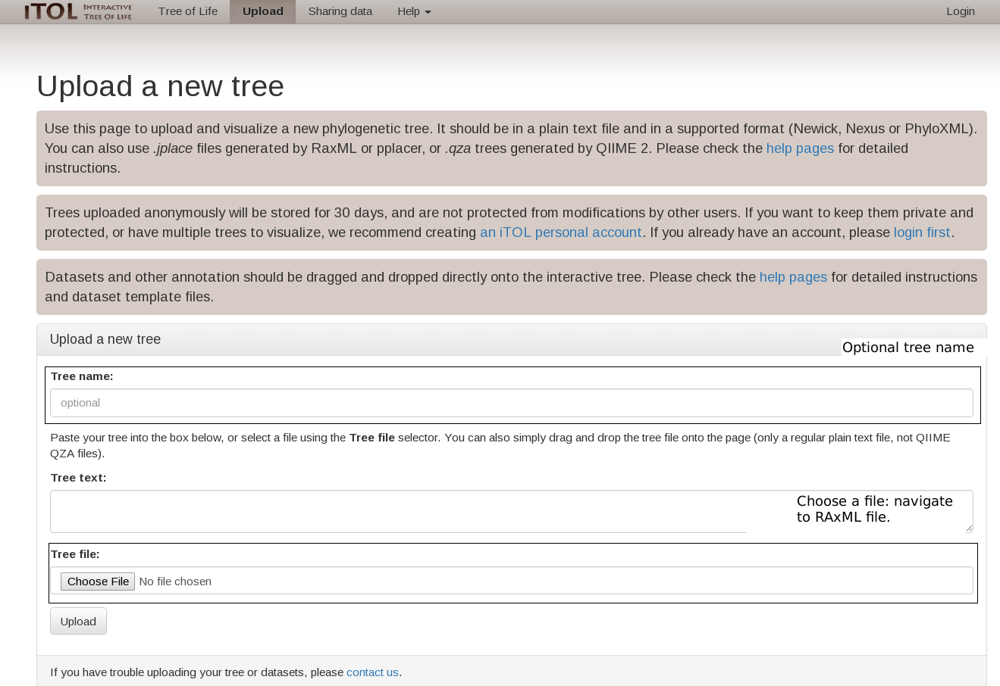
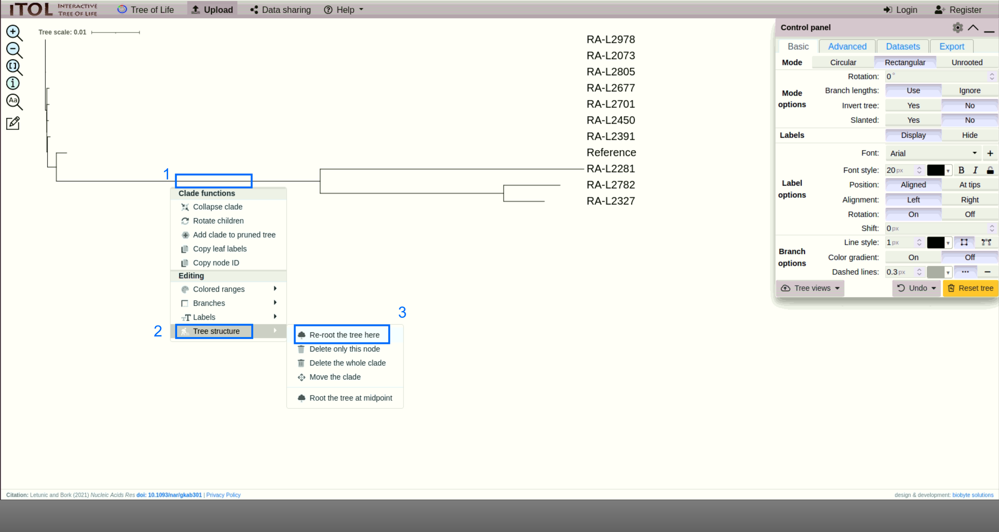
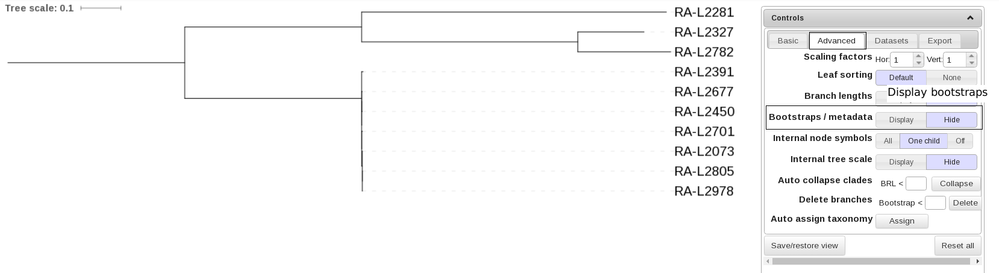
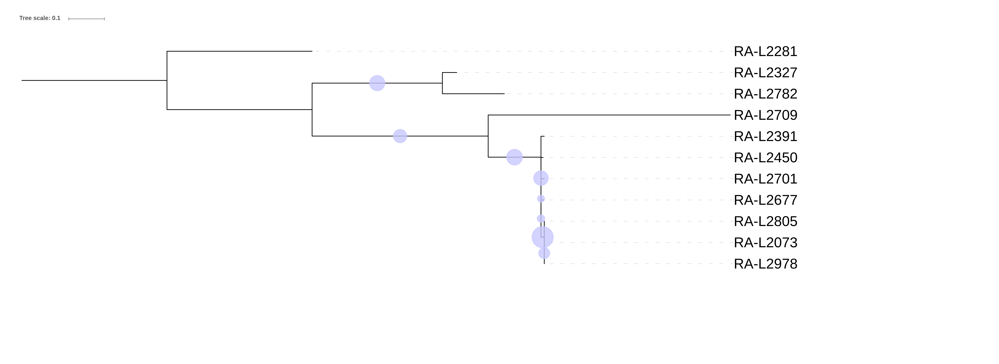

# Bacterial WGS training : Exercise 3

|**Title**| SNP-based bacterial outbreak investigation.|
|---------|-------------------------------------------|
|**Training dataset:**|                                |
|**Questions:**| <ul><li>Do I have the needed depth of coverage?</li><li>Have I chosen the correct reference?</li><li>How do I create a SNP matrix? How many SNPs do I have?</li><li>How can I visualize my phylogenetic tree? Which problems can I encounter?</li><li>Which strains belong to the outbreak?</li></ul>|
|**Objectives**:|<ul><li>Trimming and quality control of raw reads.</li><li>Mapping against genome reference and duplicate filter.</li><li>Variant Calling.</li><li>SNP matrix creation.</li><li>Maximum Likelihood phylogeny.</li><li>Visualization of results.</li></ul>|  
|**Time estimation**:| 1 h|
|**Key points**:|<ul><li>Importance of reference selecion in SNP-based tipification.</li><li>Variant calling and SNP reconstruction is a key step in the process.</li><li>Interpretation of results is case, species and epidemiology dependant.</li></ul>|
  

## Introduction
Although scientific community efforts have been focused on assembly-based methods and the optimization of reconstructing complete genomes, variant calling is a essential procedure that allows per base comparison between different genomes ([Olson et al 2015](https://www.frontiersin.org/articles/10.3389/fgene.2015.00235/full)).

SNP-based strain typing using WGS can be performed via reference-based mapping of either reads or assembled contigs. There are many available microbial SNP pipelines, such as [Snippy](https://github.com/tseemann/snippy), [NASP](https://github.com/TGenNorth/NASP), [SNVphyl](https://snvphyl.readthedocs.io/en/latest/), [CFSAN SNP Pipeline](https://github.com/CFSAN-Biostatistics/snp-pipeline), or [Lyve-SET](https://github.com/lskatz/lyve-SET). 

Variant calling is a process with a bunch of potential error sources that may lead to incorrect variant calls. Identifying and resolving this incorrect calls is critical for bacterial genomics to advance. In this exercise we will use WGS-Outbreaker a SNP-based tool developed by BU-ISCIII that uses bwa mapper, GATK variant caller and several SNP-filtering steps for SNP matrix contruction following maximun likelihood phylogeny using RAxML. Next image resumes the steps we are going to execute:

<p align="center"></p>

## Preprocessing

## Mapping

## Variant Calling
We are using WGS-Outbreaker as the main software for variant calling, SNP-matrix creation and phylogeny performance. Following the development of the former exercises we are using nextflow, in this case using `outbreakSNP` step.
This step includes the following processes:
- Preprocessing: 
    - Trimming with trimmomatic software.
    - Quality control with fastQC.
- WGS-Outbreak software comprises the rest of steps:
    - Mapping with bwa.
    - Variant calling with GATK.
    - SNP-Matrix creation.
    - SNP-filtering:
        * PhredQ > 30
        * Strand-bias
        * MAPQ
        * SNP cluster, < 3 SNPs / 1000 pb
        
Everything clear..? So let's run it. 

### Run the exercise
First of all we need to be clear in which folder we are. We need to be in our working directory `/home/alumno/Documents/wgs` and our training dataset downloaded the first day must be there (If you had any problem the previous sessions please refere to the [setup tutorial](00_SetUp.md)).

You can run this command to check where you are:
```Bash
pwd
```
Output:
```
/home/alumno/Documents/wgs
```
And this one to list all the files in your working directory. Check there is the training_dataset folder and the results folder from previous sessions.
```Bash
ls
```
Output:
```
training_dataset results work
```

Once our localization is correct we will launch nextflow with the next parameters:
  - Raw reads
  - step outbreakSNP
  - saveTrimmed -> this parameters saves the fastq files trimmed in our results dir.
  - outbreaker_config <- config file with all the parameters required by WGS-Outbreaker

```Bash
nextflow BU-ISCIII/bacterial_wgs_training run --reads 'training_dataset/downsampling_250K/*_R{1,2}.fastq.gz' \
  --fasta training_dataset/listeria_NC_021827.1_NoPhagues.fna \
  --step outbreakSNP \
  -profile singularity \
  --saveTrimmed \
  --outbreaker_config training_dataset/outbreaker.config \
  -resume
```

Output:

```Bash
N E X T F L O W  ~  version 0.29.0                                                                                                                   
Launching `main.nf` [distracted_magritte] - revision: 3508cbd2da                                                                                     
WARN: Process `multiqc` is defined two or more times                                                                                                 
WARN: Process `multiqc` is defined two or more times                                                                                                 
WARN: Process `multiqc` is defined two or more times                                                                                                 
=========================================                                                                                                            
 BU-ISCIII/bacterial_wgs_training : WGS analysis practice v1.0                                                                                       
=========================================                                                                                                            
Reads                : test/full_dataset/*_R{1,2}*.fastq.gz                                                                 
Data Type            : Paired-End                         
Fasta Ref            : test/listeria_NC_021827.1_NoPhagues.fna                                                             
Keep Duplicates      : false                                                                                                 
Step                 : outbreakSNP                                                                                           
Container            : ./wgs_bacterial.simg                                            
Current home         : /home/smonzon                                                                                         
Current user         : smonzon                                                                                               
Current path         : /home/smonzon/Documents/desarrollo/bacterial_wgs_training                                             
Working dir          : /home/smonzon/Documents/desarrollo/bacterial_wgs_training/work                                        
Output dir           : results                                                                                               
Script dir           : /home/smonzon/Documents/desarrollo/bacterial_wgs_training                                             
Save Reference       : false                                                                                               
Save Trimmed         : true
Save Intermeds       : false
Trimmomatic adapters file: $TRIMMOMATIC_PATH/adapters/NexteraPE-PE.fa
Trimmomatic adapters parameters: 2:30:10
Trimmomatic window length: 4
Trimmomatic window value: 20
Trimmomatic minimum length: 50
Config Profile       : singularity
====================================
[warm up] executor > local
[ca/cbb117] Submitted process > fastqc (RA-L2805)
[4b/65f7a1] Submitted process > fastqc (RA-L2450)
[32/8ebe88] Submitted process > fastqc (RA-L2281)
[23/04ab41] Submitted process > fastqc (RA-L2073)
[a7/f9e938] Submitted process > fastqc (RA-L2391)
[75/709471] Submitted process > trimming (RA-L2073)
[94/87b2b5] Submitted process > makeBWAindex (listeria_NC_021827.1_NoPhagues)
[94/b39b86] Submitted process > trimming (RA-L2805)
[df/e01505] Submitted process > fastqc (RA-L2709)
..................
BU-ISCIII - Pipeline complete
```

>This will take a while so we need to move forward and understand what we are doing and learn how to see and interpret our results.

### Understanding WGS-Outbreaker config file
First of all, let's take a look to the config file for a moment: [WGS-Outbreaker config_file](../config.file). This file will allow us to configure all necessary parameters for running WGS-Outbreaker.
The file is organized in several sections.
1. **Steps configuration:** in this section we can select with YES/NO which pipeline steps we would want to run, in this case we have prefilled the steps that we can run in this trainning.
```
############################# Pipeline steps: Fill in with YES or NO (capital letter) ###################################
TRIMMING=NO
CHECK_REFERENCES=YES
MAPPING=YES
DUPLICATE_FILTER=YES
VARIANT_CALLING=YES
KMERFINDER=NO
SRST2=NO
CFSAN=NO
VCF_TO_MSA=YES
RAXML=YES
STATS=YES
```
2. **Input data:** we can provide the path where the input files are, and the path where we want our results. Also we can include our sample names and the raw reads filenames. These reads must be in the input directory provided.
```
# Directory with input files
INPUT_DIR=/home/smonzon/Documents/desarrollo/bacterial_wgs_training/results/trimming

# Directory for output files
OUTPUT_DIR=/home/smonzon/Documents/desarrollo/bacterial_wgs_training/results/wgs_outbreaker

########################################## INPUT VARIABLES########################################################

# Samples info:
# All samples ID must be separated by ":", then for each sample there must be a line with the names for
# R1 and R2 separated by tabulator
# Example:
	#=AAAA_01:BBBB_02
	# AAAA_01=AAAA_01_R1.fastq.gz    AAAA_01_R2.fastq.gz
	# BBBB_02=BBBB_02_R1.fastq.gz    BBBB_02_R2.fastq.gz
```
Moreover we have to include the path for our reference files:
```
######################################################### Reference Variables ###########################################

# Path to reference genome
GENOME_REF=listeria_NC_021827.1_NoPhagues.fna

# Path to reference genome without ".fasta"
GENOME_NAME=listeria_NC_021827.1_NoPhagues
```
3. **Trimming, mapping, variant calling and phylogeny parameters:** The end of the config file includes a series of default parameters we use for our analysis, mainly in foodborne bacteria, but that can be modified in order to match other analysis or other species requirements.
For example the most variable parameter we can probably find is the maximum number of SNPs we are going to allow in a sequence window. This parameter is going to depend on the species variability, and also on the similarity of our reference with the isolates being analyzed.
```
##############  SNP FILTERS #########################
# The maximum number of SNPs allowed in a window.
MAX_SNP=3

# The length of the window in which the number of SNPs should be no more than max_num_snp
WINDOW_SIZE=1000
```
### Results analysis
Let's proceed to analyze the results. We can find them in:
```
/home/alumno/Documents/wgs/results_def/wgs_outbreaker
```
This directory contains several folders including:
```
├── Alignment -> already analyzed 
├── QC -> already analyzed
├── raw -> symbolic links to raw reads
├── RAXML -> phylogenetic results
├── stats -> alignment and variant calling stats.
└── variant_calling -> variant calling files.
```
Since alignment and quality control results has been previously addresed in this course (see [02_QualityAndAssembly.md](02_QualityAndAssembly.md) and [Mapping Section](#Mapping)), we will proceed to analyze variant calling results.

#### Variant calling results
Variants are stored in plain text files in vcf format (variant calling format). Vcf files can be found in:
```
wgs_outbreaker/variant_calling/variants_gatk/variants
```
Here we can find a bunch of vcf files for each filtering steps we made:
- *.g.vcf <- this file contains a special vcf format that includes both variant and invariants sites information.
- snps_indels.vcf <- contains raw variants, both indels and snps found by GATK in the samples. This is a multisample vcf file and contains genotype information for all the samples at the same time.
- In order to follow GATK's best practice protocol for high quality variant filtering, snps and indels must be treated separately, so we have snps_only_flags.vcf and indels_only_flags.vcf with quality flags for each type of variants.
```
##fileformat=VCFv4.2
##FILTER=<ID="p-value StrandBias",Description="FS > 60.0">
##FILTER=<ID=LowQD,Description="QD < 2.0">
##FILTER=<ID=LowQual,Description="Low quality">
##FILTER=<ID=MaxDepth,Description="DP < 5">
##FILTER=<ID=RMSMappingQuality,Description="MQ < 40.0">
##FILTER=<ID=SnpCluster,Description="SNPs found in clusters">
##FILTER=<ID=StandOddRatio,Description="SOR > 3.0">
##FORMAT=<ID=AD,Number=R,Type=Integer,Description="Allelic depths for the ref and alt alleles in the order listed">
##FORMAT=<ID=DP,Number=1,Type=Integer,Description="Approximate read depth (reads with MQ=255 or with bad mates are filtered)">
##FORMAT=<ID=GQ,Number=1,Type=Integer,Description="Genotype Quality">
##FORMAT=<ID=GT,Number=1,Type=String,Description="Genotype">
##INFO=<ID=AC,Number=A,Type=Integer,Description="Allele count in genotypes, for each ALT allele, in the same order as listed">
##INFO=<ID=AF,Number=A,Type=Float,Description="Allele Frequency, for each ALT allele, in the same order as listed">
##INFO=<ID=AN,Number=1,Type=Integer,Description="Total number of alleles in called genotypes">
##INFO=<ID=BaseQRankSum,Number=1,Type=Float,Description="Z-score from Wilcoxon rank sum test of Alt Vs. Ref base qualities">
##INFO=<ID=QD,Number=1,Type=Float,Description="Variant Confidence/Quality by Depth">
##INFO=<ID=RAW_MQ,Number=1,Type=Float,Description="Raw data for RMS Mapping Quality">
##INFO=<ID=ReadPosRankSum,Number=1,Type=Float,Description="Z-score from Wilcoxon rank sum test of Alt vs. Ref read position bias">
##INFO=<ID=SOR,Number=1,Type=Float,Description="Symmetric Odds Ratio of 2x2 contingency table to detect strand bias">
##contig=<ID=NC_021827.1,length=2953716>
##contig=<ID=NC_022047.1,length=55804>
##reference=file:///home/smonzon/Documents/bacterial_wgs_training/work/ba/20837f0b9838403205e62589d7ac8b/listeria_NC_021827.1_NoPhagues.fna
##source=SelectVariants
#CHROM	POS	ID	REF	ALT	QUAL	FILTER	INFO	FORMAT	RA-L2073	
NC_021827.1	276	.	C	A	291.68	RMSMappingQuality;SnpCluster;StandOddRatio	AC=1;AF=0.100;AN=10;DP=35;FS=0.000;MLEAC=1;MLEAF=0.100;MQ=38.49;QD=34.24;SOR=4.407	GT:AD:DP:GQ:PL	0:3,0:3:99:0,117
NC_021827.1	731	.	A	G	2313.68	SnpCluster	AC=1;AF=0.100;AN=10;DP=101;FS=0.000;MLEAC=1;MLEAF=0.100;MQ=60.00;QD=33.05;SOR=0.811	GT:AD:DP:GQ:PL	0:3,0:3:99:0,101
NC_021827.1	921	.	C	T	1841.68	SnpCluster	AC=1;AF=0.100;AN=10;DP=110;FS=0.000;MLEAC=1;MLEAF=0.100;MQ=60.00;QD=29.70;SOR=0.826	GT:AD:DP:GQ:PL	0:3,0:3:99:0,101
NC_021827.1	1067	.	C	T	2250.68	SnpCluster	AC=1;AF=0.100;AN=10;DP=168;FS=0.000;MLEAC=1;MLEAF=0.100;MQ=60.00;QD=31.70;SOR=0.779	GT:AD:DP:GQ:PL	0:3,0:3:99:0,101
NC_021827.1	2114	.	C	T	8324.89	SnpCluster	AC=3;AF=0.300;AN=10;DP=341;FS=0.000;MLEAC=3;MLEAF=0.300;MQ=60.00;QD=30.49;SOR=0.841	GT:AD:DP:GQ:PL	0:3,0:3:99:0,101
NC_021827.1	2180	.	G	A	7855.89	SnpCluster	AC=3;AF=0.300;AN=10;DP=342;FS=0.000;MLEAC=3;MLEAF=0.300;MQ=60.00;QD=28.67;SOR=0.832	GT:AD:DP:GQ:PL	0:3,0:3:99:0,101
```
- Finally we continue to filter snps calls for our SNP matrix, and we filter SNPs which are included in a window of 1000 pb with an acumulation of more than 3 snps. We process two files snps_Pass.fasta and snps_PassCluster.fasta, one including only SNPs that PASS all the filters, and one that includes PASS snps and also those filtered by our cluster filter. We do this because usually we haven't select the window size and max snps properly for our samples and we need to analyze the complete set of SNPs.

#### Phylogeny results
Phylogenetic tree reconstruction is performed using RAxML with 100 inferences and 100 bootstrap repetitions. RAxML results can be checked in RAxML folder:
```
/home/Alumno/Documents/wgs/results/RAxML/{variant_caller}
```
Two different trees are generated one with only SNPs passing all filters (preser) and one with all snps (all_snp). Both trees are outputed for evaluation. In this case we are going to use the tree with the filtered SNPs because snp cluster filter has performed correctly.

RAxML outputs one file per inference and per bootstrap so the folder is full of files. Don't worry we only need the final tree file, which is in newick format for visualization. The file is called:
```
RAxML_bipartitions.RAXML_TREE_ANNOT
```
Now we are going to open firefox browser and go to [iTOL website](https://itol.embl.de/). This web allows us to visualize and annotate phylogenetics trees with a very user-friendly interface. Also, it has good exporting options for publication.

Once in iTOL website we click in Upload in the top menu. Next we upload our tree as shown in the image:
<p align="center"></p>

Now we are visualizing our tree and we can manipulate it. First of all, as we are facing an unrooted tree with long and small branches, we are going to perform a midpoint rooting method for improve the visualization. For this we choose the longest branch an we click on it. We have to get a menu like this image:
<p align="center"></p>

iTOL offers multiple annotation and maniputation options. We can selecto for example the display of bootstrap in the advance tab.
<p align="center"></p>

You can play with all the options iTOL offers reading its [documentation](https://itol.embl.de/help.cgi), and export the tree in the export tab. 

<p align="center"></p>

Now we are going to focus on our results. Our final tree should look something like this:

<p align="center"></p>

Which strains do you think belong to the outbreak?
Tips: At this point you should focus on the bootstrap and the branch lenght.

#### SNPs distance
As we have studied in the theory class, maximum likelihood methods for phylogeny only offers as branch lenght the average nucleotide substitution rate, this means the branch lenght is only a estimation of the number of nucleotide changes a strain has suffer respect to another.
In order to know exactly the SNPs differences between the strains WGS-Outbreaker outputs a distance matrix showing the paired diffences among the samples.
We can check this file in:
```
/home/alumno/Documents/wgs/results/wgs_outbreaker/stats
```

|dis_matrix.names|RA.L2073|RA.L2281|RA.L2327|RA.L2391|RA.L2450|RA.L2677|RA.L2701|RA.L2782|RA.L2805|RA.L2978|
|----------------|--------|--------|--------|--------|--------|--------|--------|--------|--------|--------|
|RA-L2073|0|9403|9028|80|46|46|49|9120|4|2|
|RA-L2281|9403|0|8777|9415|9397|9397|9402|9183|9403|9401|
|RA-L2327|9028|8777|0|9040|9022|9022|9027|4277|9028|9026|
|RA-L2391|80|9415|9040|0|74|74|79|9132|80|78|
|RA-L2450|46|9397|9022|74|0|38|45|9114|46|44|
|RA-L2677|46|9397|9022|74|38|0|45|9114|46|44|
|RA-L2701|49|9402|9027|79|45|45|0|9119|49|47|
|RA-L2782|9120|9183|4277|9132|9114|9114|9119|0|9120|9118|
|RA-L2805|4|9403|9028|80|46|46|49|9120|0|2|
|RA-L2978|2|9401|9026|78|44|44|47|9118|2|0|


As we see the SNP difference cutoff is important here, and it will depend on the strain and the case. If we stablish 3-5 snps as our cutoff we can detect that the strains belonging to the outbreak are: 2978, 2805 and 2073
