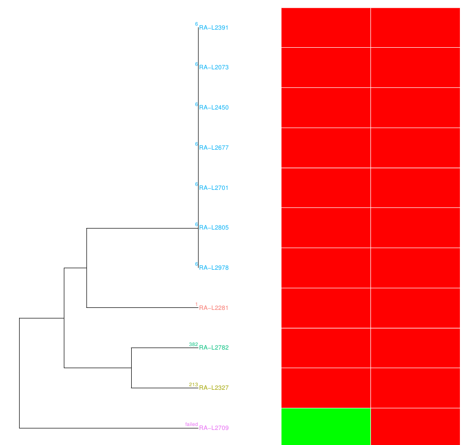
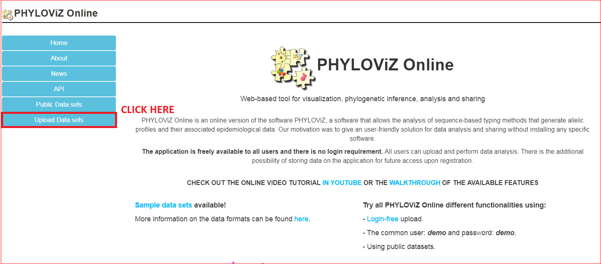
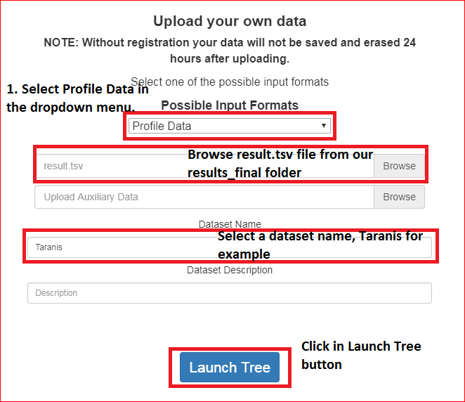
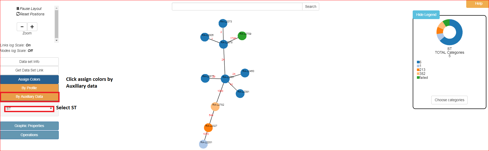
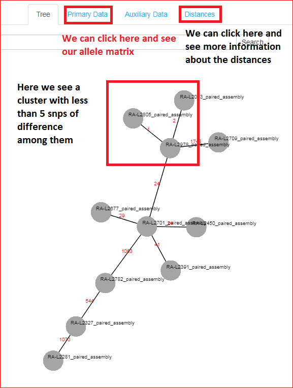

# Bacterial WGS training : Exercise 4

<div class="tables-start"></div>

|**Title**| cgMLST bacterial outbreak investigation.|
|---------|-------------------------------------------|
|**Training dataset:**|                                |
|**Questions:**| <ul><li>Do I have the needed depth of coverage?</li><li>Do I have correct assemblies?</li><li>How do I download a cgMLST schema?</li><li>How can I analyze my samples using a cgMLST schema?</li><li>How do I visualize the results?</li><li>Which strains belong to the outbreak?</li></ul>|
|**Objectives**:|<ul><li>Trimming and quality control of raw reads.</li><li>Assembly and quality control</li><li>cgMLST analysis</li><li>Minnimum spanning tree visualization</li><li>Results interpretation</li></ul>|
|**Time estimation**:| 1 h|
|**Key points**:|<ul><li>Importance of assembly in cgMLST typification.</li><li>Summary of alleles reconstruction, and missing data is important.</li><li>Interpretation of results is case, species and epidemiology dependant.</li></ul>|

<div class="tables-end"></div>

## Introduction

<p align="center"></p>

## Preprocessing
Addressed in previous exercises.

## Strain characterization: Serogroup and sequence type (ST) determination using WGS data.
Performing MLST, serogroup or resistance analysis can't be easing using WGS. Here we are going to use a mapping approach using [srst2](https://github.com/katholt/srst2) software for determining ST and serogroup of the listeria isolates without doing any PCR.

### Run the exercise
```
cd
cd Documents/wgs
nextflow run BU-ISCIII/bacterial_wgs_training --reads 'training_dataset/*_R{1,2}*.fastq.gz' \
--fasta training_dataset/listeria_NC_021827.1_NoPhagues.fna \
-profile singularity \
--step strainCharacterization \
--srst2_db_mlst training_dataset/mlst_pasteur_listeria.fas \
--srst2_def_mlst training_dataset/mlst_pasteur_listeria.scheme \
--srst2_db_sero training_dataset/pcr_serogroup_listeria.fas \
--srst2_def_sero training_dataset/pcr_serogroup_listeria.scheme \
--srst2_resistance training_dataset/ARGannot.r1.fasta \
-resume
```

Below this command two srst2 commands are performed using the mlst and serogroup schema downloaded from [Pasteur bigsdb](http://bigsdb.pasteur.fr/perl/bigsdb/bigsdb.pl?db=pubmlst_listeria_seqdef_public).
```
srst2 --input_pe reads_R1.fastq.gz readsR2 \
--forward "_R1" --reverse "_R2" --output output \
--log --mlst_db db_mlst --mlst_definition mlst_scheme \
--mlst_delimiter "_"
```
Parameters:
- input_pe: fastq reads
- forward/reverse: name of R1-R2 reads for file name parsing.
- output: how to name the results.
- mlst_db: fasta file with all the alleles for all the genes present in the schema.
- mlst_definition: plain text file with the definition of the STs with which alleles. This is known as the mlst profile.

> mlst_db and mlst_definition both can be downloaded from Pasteur bigsdb of PubMLST site for a bunch of different microorganisms.

### Results analysis

The serogroup results look like this, and it can be found in the next path:
```
/home/alumno/course_shared_folder/results/SRST2_SERO/summary.txt
```

<div class="tables-start"></div>

|Sample|ST|lmo0737|lmo1118|ORF2110|ORF2819|prs|mismatches|uncertainty|depth|maxMAF|
|------|--|-------|-------|-------|-------|---|----------|-----------|-----|------|
|RA-L2073|IVb (13)|-|-|3|3|2|0|-|37.6266666667|0.0666666667|
|RA-L2281|IVb (2)|-|-|1|1|2|0|-|50.97|0.0588235294|
|RA-L2327|IVb (2)|-|-|1|1|2|0|-|45.4216666667|0.0606060606|
|RA-L2391|IVb (13)|-|-|3|3|2|0|-|45.8916666667|0.0588235294|
|RA-L2450|IVb (13)|-|-|3|3|2|0|-|50.9196666667|0.0869565217|
|RA-L2677|IVb (13)|-|-|3|3|2|0|-|56.1036666667|0.0606060606|
|RA-L2701|IVb (13)|-|-|3|3|2|0|-|54.2813333333|0.0666666667|
|RA-L2709|NF|-|-|-|-|-|-|-|-|-|
|RA-L2782|IVb-v1 (1)|7|-|1|1|2|0|-|62.3865|0.0363636364|
|RA-L2805|IVb (13)|-|-|3|3|2|0|-|49.676|0.064516129|
|RA-L2978|IVb (13)|-|-|3|3|2|0|-|50.1983333333|0.0588235294|

<div class="tables-end"></div>

The MLST results look like this other table, and can be found in:
```
/home/alumno/course_shared_folder/results/SRST2_MLST/summary.txt
```

<div class="tables-start"></div>

|Sample|ST|abcZ|bglA|cat|dapE|dat|ldh|lhkA|mismatches|uncertainty|depth|maxMAF|
|------|--|----|----|---|----|---|---|----|----------|-----------|-----|------|
|RA-L2073|6|3|9|9|3|3|1|5|0|-|59.0544285714|0.0634920634921|
|RA-L2281|1|3|1|1|1|3|1|3|0|-|62.8174285714|0.0588235294118|
|RA-L2327|213|1|1|9|13|2|5|5|0|-|53.0774285714|0.0625|
|RA-L2391|6|3|9|9|3|3|1|5|0|-|55.9001428571|0.0434782608696|
|RA-L2450|6|3|9|9|3|3|1|5|0|-|54.7685714286|0.0526315789474|
|RA-L2677|6|3|9|9|3|3|1|5|0|-|62.4725714286|0.0444444444444|
|RA-L2701|6|3|9|9|3|3|1|5|0|-|67.599|0.037037037037|
|RA-L2709|failed|-|-|-|-|-|-|-|-|-|-|-|
|RA-L2782|382|1|51|11|13|2|5|5|0|-|55.8924285714|0.05|
|RA-L2805|6|3|9|9|3|3|1|5|0|-|66.4684285714|0.047619047619|
|RA-L2978|6|3|9|9|3|3|1|5|0|-|52.4057142857|0.0625|

<div class="tables-end"></div>

We will describe here the meaning of each column:
- Sample: sample name
- ST: serotype or serogroup determined.
- lmo0737-prs: names of the genes present in the MLST schema in this case. This column will vary depending on the species and the schema used. Each column shows the allele number determined for each sample.
- mismatches: number of mismatches (SNPs) found against the reference allele.
- uncertainty: a score showing the probability of having determined the correct allele (ST).
- depth: depth of coverage achieved mapping against this allele.
- maxMAF: maximum Minimum Allele frequency, this shows the percentage of the samples having the same allele that this sample.

And finally we can plot a clustering using MLST profile with a resistance heatmap for visualization:

<p align="center"></p>

## Assembly
Addressed in previous exercises.
## cgMLST Analysis
We are using Taranis as the main software for cgMLST analysis. Following the development of the former exercises we are using nextflow, in this case using `outbreakMLST` step.
This step includes the following processes:
  - Preprocessing with trimmomatic and FastQC.
  - Assembly and quality control.
  - Download of cgMLST schema for L. monocytogenes from Pasteur bigsdb site.
  - cgMLST analysis using Taranis app.

### Run the exercise
First of all we need to be clear in which folder we are. We need to be in our working directory `/home/alumno/Documents/wgs` and our training dataset downloaded the first day must be there (If you had any problem the previous sessions please refere to the [setup tutorial](00_SetUp.md)).

You can run this command to check where you are:
```Bash
pwd
```
Output:
```
/home/alumno/Documents/wgs
```
And this one to list all the files in your working directory. Check there is the training_dataset folder and the results folder from previous sessions.
```Bash
ls
```
Output:
```
training_dataset results work
```
Once our localization is correct we will launch nextflow with the next parameters:
  - Raw reads
  - step outbreakMLST
  - gtf file needed for assembly step.

```
nextflow run BU-ISCIII/bacterial_wgs_training \
--reads 'training_dataset/*R{1,2}*.fastq.gz' \
--fasta training_dataset/listeria_NC_021827.1_NoPhagues.fna \
--step outbreakMLST \
--gtf training_dataset/listeria_NC_021827.1_NoPhagues.gff \
-profile singularity
```

**Output:**
```
N E X T F L O W  ~  version 0.32.0
Launching `BU-ISCIII/bacterial_wgs_training` [sad_ptolemy] - revision: 068d646a9e [master]
WARN: Process `multiqc` is defined two or more times
WARN: Process `multiqc` is defined two or more times
WARN: Process `multiqc` is defined two or more times
=========================================
 BU-ISCIII/bacterial_wgs_training : WGS analysis practice v1.0
=========================================
Reads                : training_dataset/*_R{1,2}.fastq.gz
Data Type            : Paired-End
Fasta Ref            : training_dataset/listeria_NC_021827.1_NoPhagues.fna
GTF File             : training_dataset/listeria_NC_021827.1_NoPhagues.gff
Keep Duplicates      : false
Step                 : outbreakMLST
Container            : ./wgs_bacterial.simg
Pipeline Release     : master
Current home         : /home/alumno
Current user         : alumno
Current path         : /home/alumno/Documents/wgs
Working dir          : /home/alumno/Documents/wgs/work
Output dir           : results
Script dir           : /home/alumno/.nextflow/assets/BU-ISCIII/bacterial_wgs_training
Save Reference       : false
Save Trimmed         : false
Save Intermeds       : false
Trimmomatic adapters file: $TRIMMOMATIC_PATH/adapters/NexteraPE-PE.fa
Trimmomatic adapters parameters: 2:30:10
Trimmomatic window length: 4
Trimmomatic window value: 20
Trimmomatic minimum length: 50
Config Profile       : singularity
====================================
[warm up] executor > local
[45/0e3862] Submitted process > fastqc (RA-L2281)
[f2/417d0b] Submitted process > scheme_download (SchemeDownload)
[34/ca35c2] Submitted process > fastqc (RA-L2701)
[e4/4c2690] Submitted process > trimming (RA-L2281)
................
BU-ISCIII Workflow complete
```
This will take a while as usual, and it is performed with a downsampled dataset, so we will describe here the results with the full dataset for practice our interpretation.

### Results analysis
Let's proceed to analyze the results. We can find them in:
```
/home/alumno/course_shared_folder/results_final/Taranis
```
This directory contains several files including:
```
├── deletions.tsv -> sequence of alleles with deletions detected.
├── inferred_alleles.tsv -> sequences for inferred alleles (not present in the scheme)
├── insertions.tsv -> sequence of alleles with deletions detected.
├── matching_contigs.tsv -> contigs where alleles are found.
├── paralog.tsv -> paralogues genes found.
├── plot.tsv -> locus found in end of start of a contig (possible broken cds)
├── result.tsv -> allele matrix.
├── snp.tsv -> snps found in inferred alleles (beta feature)
└── summary_result.tsv -> summary of found/not found alleles.
```
Since alignment and quality control results has been previously addresed in this course (see [02_QualityAndAssembly.md](02_QualityAndAssembly.md), we will proceed to analyze cgMLST results.

The most important files at this point for cgMLST analsysis are ```results.tsv``` and ```summary_result.tsv``` files. Remaining files are useful for particular analysis where we may want to look at things not present at the cgMLST, or to explain some phenotipic behaviour.

We will focus on the main output in this exercise. In the summary file we will find which alleles have been found as exact match against a scheme allele, which ones were new inferred alleles, and which ones are alleles not found in or samples, have deletions/insertions or may be caused by a bad assembly.

In this case we obtain something like this:

<div class="tables-start"></div>
|File|Exact match|INF|ASM_INSERT|ASM_DELETE|ALM_INSERT|ALM_DELETE|LNF|NIPH|NIPHEM|PLOT|ERROR|
|----|-----------|---|----------|----------|----------|----------|---|----|------|----|-----|
|RA-L2073|1744|3|0|0|1|0|0|0|0|0|0|
|RA-L2281|1747|1|0|0|0|0|0|0|0|0|0|
|RA-L2327|1744|4|0|0|0|0|0|0|0|0|0|
|RA-L2391|1747|1|0|0|0|0|0|0|0|0|0|
|RA-L2450|1745|3|0|0|0|0|0|0|0|0|0|
|RA-L2677|1731|13|1|0|0|0|0|0|0|3|0|
|RA-L2701|1740|8|0|0|0|0|0|0|0|0|0|
|RA-L2709|0|0|0|0|0|0|1748|0|0|0|0|
|RA-L2782|1746|1|1|0|0|0|0|0|0|0|0|
|RA-L2805|1745|3|0|0|0|0|0|0|0|0|0|
|RA-L2978|1746|2|0|0|0|0|0|0|0|0|0|

<div class="tables-end"></div>

But...it may be useful for you taking a look at the downsampling results this time, what happens with the cgMLST analysis when we use data with low coverage, and consequently a fragmented analysis? The summary results changes and we see this:

**TODO INCLUDE TABLE**

>PLOT alleles rise notably, this is because fragmented genome makes more probable the appearance of broken cds that fall in the start of end of a contig.

## Minimum spanning tree visualization
In order to generate the minimum spanning tree from our ```results.tsv``` file we are going to use [Phyloviz](https://online.phyloviz.net/index), an online tool for MST visualization.

So..open click [here](https://online.phyloviz.net/index) and phyloviz website should open

<p align="center"></p>

Next we need to upload our file, so we select profile data as input and select *Launch tree*

<p align="center"></p>

We now have our minimum spanning tree but it looks pretty ugly and with little information. Let's add the samples names to the nodes. In order to do this we have to click on Graphic propertis in the left dropdown menu, click on nodes and check the Add Link Labels checkbox as shown in the image:

<p align="center"></p>

Next we are goint to add link labels which will show the absolute distance (number of alleles) among the nodes. As before we click on Graphic properties, next on Links and we check Add Link Labels checkbox.

<p align="center"></p>

Now we have a "pretty" minimum spanning tree with enough annotation for interpret our results. However we can also make it prettier (easy right?) adding some colors based on any locus of the profile or based on any auxiliary data we want to provide, p.e one useful data is the samples **ST**, for this we have to create
<p align="center"></p>

Finally we have out pretty MST, do you see any cluster? You can compare this result with the one obtained with the SNP-based pipeline.

<p align="center"></p>


## Conclusion
cgMLST and SNP-based approach generate the same result for this outbreak, we have between 0-5 different SNPs, and between 1-3 different alleles among the isolates belonging to the outbreak.

