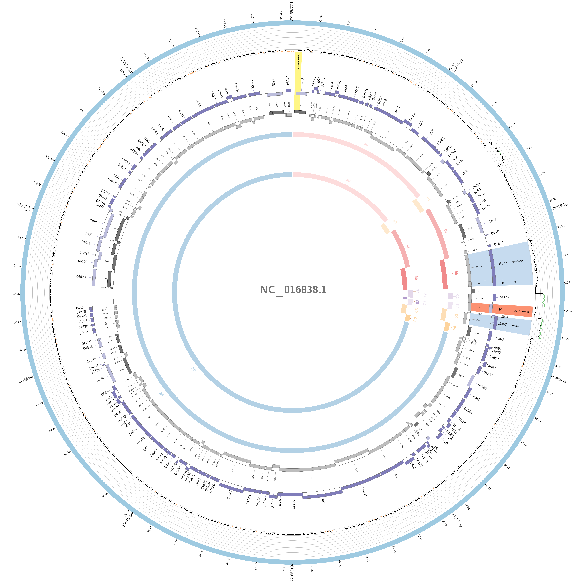
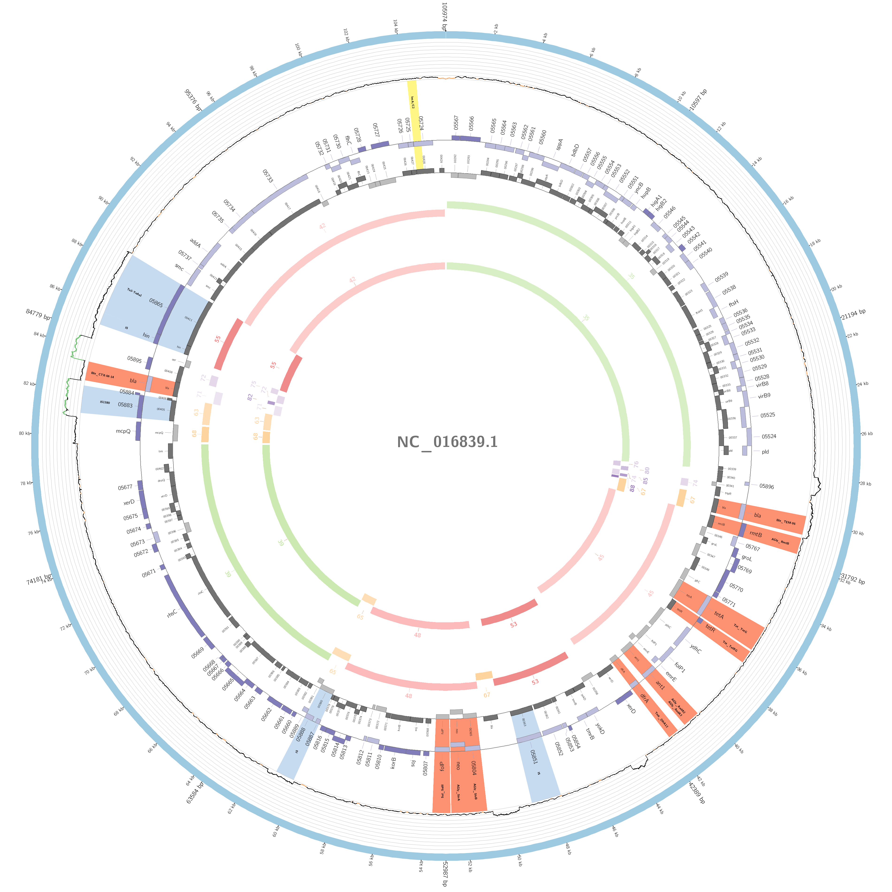
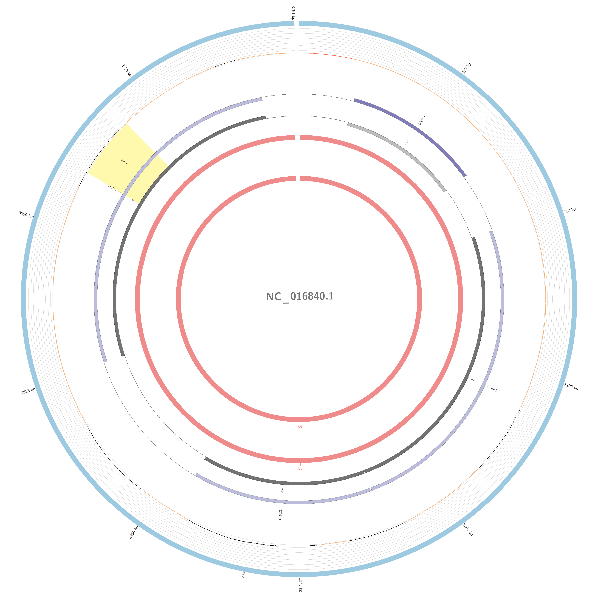
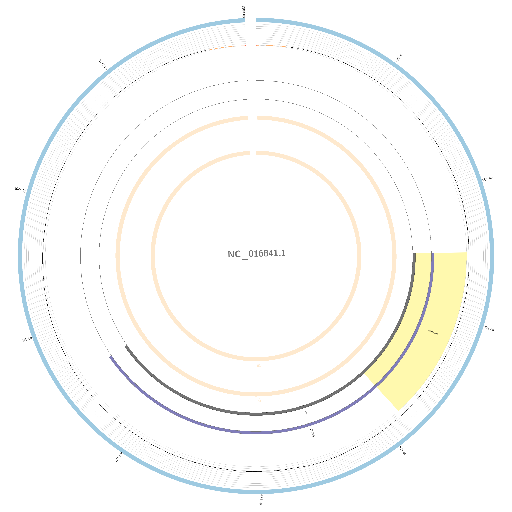
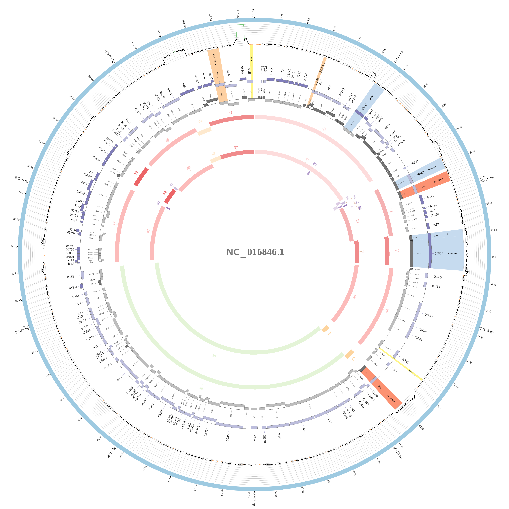
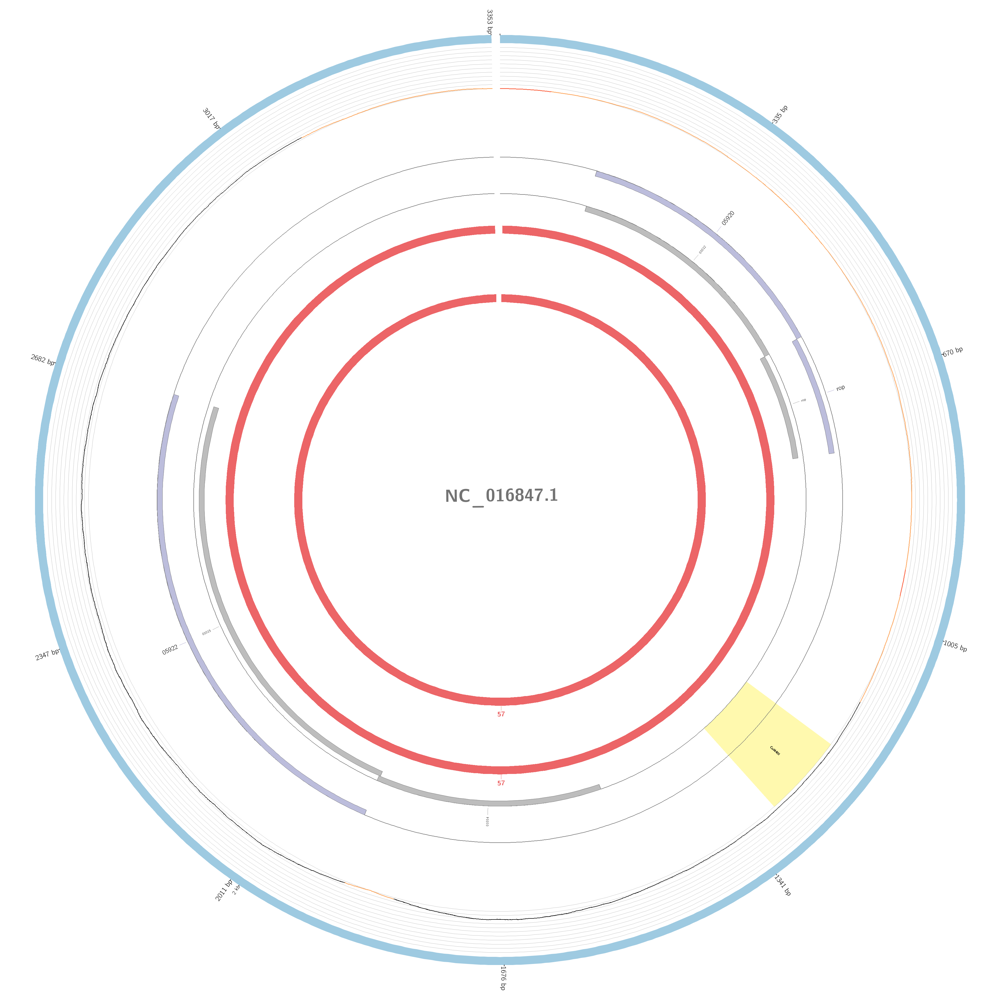

# Bacterial WGS training : Exercise 5

<div class="tables-start"></div>

|**Title**| Chromosome, plasmid, resistance and virulence annotation|
|---------|-------------------------------------------|
|**Training dataset:**|                                |
|**Questions:**| <ul><li>How many genes there are in my sample?</li><li>Are there virulence and/or antibiotic resistance genes?</li><li>Where are the genes located?</li><li>Which plasmids are present in the sample?</li><li>How do I visualize the results?</li></ul>|
|**Objectives**:|<ul><li>Annotate virulence and ABR genes</li><li>Determine gene variants</li><li>Determine plasmidome</li><li>Locate annotated genes</li><li>Results interpretation</li></ul>|
|**Time estimation**:| 1 h|
|**Key points**:|<ul><li>Comparing annotation using mapping vs assembly</li><li>Plasmid, virulence and resistance determination</li></ul>|
<<<<<<< HEAD

=======

  <p align="center"></p>


>>>>>>> 1ac4d30d8ca8e4a68ff238b9bba5705ab11fea69
- [Introduction](#introduction)
- [Exercise](#exercise)
    - [Mapping based annotation](#mapping-based-annotation)
    - [Assembly based annotation](#assembly-based-annotation)

<div class="tables-start"></div>

## Introduction

In this exercise we are going to determine the genomic content of a multidrug-resistant (MDR) *K. neumoniae* isolate.
First we will usse [srst2](https://github.com/katholt/srst2) to asses the resistome and later, we will use [plasmidID](https://github.com/BU-ISCIII/plasmidID) to infer biological and positional information to sequences and see where the genes, detected with mapping strategy, are located.

### Training dataset description
The sample we are going to analyse is an *in silico* dataset obtained with [wgsim](https://github.com/lh3/wgsim) using a sample of [*Klebsiella pneumoniae subsp. pneumoniae HS11286*](https://www.ncbi.nlm.nih.gov/genome/?term=klebsiella+pneumoniae) available at ncbi.

## Exercise

### Mapping based annotation

To execute srst2, which maps the reads against a antibiotic resistance genes database (ARGannot), lets execute this command:

------

```Bash
cd
cd wgs/bacterial_wgs_training_dataset/ANALYSIS
nextflow run ../../bacterial_wgs_training/main.nf \ 
--reads '../RAW/DOWNSAMPLED/*_R{1,2}*.fastq.gz' \
--fasta ../REFERENCES/listeria_NC_021827.1_NoPhagues.fna \
-profile conda \
--gtf ../REFERENCES/listeria_NC_021827.1_NoPhagues.gff \
--srst2_resistance ../REFERENCES/ARGannot.r1.fasta \
--srst2_virulence ../REFERENCES/EcOH.fasta \
--step mapAnnotation
```
------


### Results should look like that


| Sample | DB | gene | allele | coverage | depth | diffs | uncertainty | divergence | length | maxMAF | clusterid | seqid | annotation |
| :---: | :---: | :---: | :---: | :---: | :---: | :---: | :---: | :---: | :---: | :---: | :---: | :---: | :---: |
| KPN_TEST_R | ARGannot.r1 | RmtB_AGly | RmtB_1580 | 100.0 | 12.09 | 1snp |  | 0.132 | 756 | 0.125 | 309 | 1580 | no;no;RmtB;AGly;AB263754;2843-3598;756 |
| KPN_TEST_R | ARGannot.r1 | TEM-1D_Bla | TEM-117_968 | 100.0 | 33.386 | 2snp |  | 0.262 | 764 | 0.382 | 205 | 968 | no;no;TEM-117;Bla;AY130282;1-764;764 |
| KPN_TEST_R | ARGannot.r1 | KPC-1_Bla | KPC-14_809 | 100.0 | 5.412 | 1indel |  | 0.0 | 876 | 0.333 | 184 | 809 | no;no;KPC-14;Bla;JX524191;396-1271;876 |
| KPN_TEST_R | ARGannot.r1 | AmpH_Bla | AmpH_634 | 100.0 | 11.373 | 14snp |  | 1.206 | 1161 | 0.143 | 86 | 634 | no;no;AmpH;Bla;CP003785;4208384-4209544;1161 |
| KPN_TEST_R | ARGannot.r1 | CTX-M-9_Bla | CTX-M-14_102 | 100.0 | 26.676 | 1snp |  | 0.114 | 876 | 0.412 | 190 | 102 | no;yes;CTX-M-14;Bla;AF252622;1741-2616;876 |
| KPN_TEST_R | ARGannot.r1 | StrA_AGly | StrA_1501 | 100.0 | 12.502 | 2snp |  | 0.249 | 804 | 0.167 | 263 | 1501 | no;no;StrA;AGly;AJ627643;3725-4528;804 |
| KPN_TEST_R | ARGannot.r1 | StrB_AGly | StrB_1614 | 100.0 | 9.545 | 1snp |  | 0.119 | 837 | 0.167 | 227 | 1614 | no;no;StrB;AGly;KR091911;169145-169981;837 |
| KPN_TEST_R | ARGannot.r1 | AadA_AGly | AadA2_1605 | 100.0 | 9.306 | 2snp |  | 0.256 | 780 | 0.167 | 229 | 1605 | yes;no;AadA2;AGly;X68227;166-945;780 |
| KPN_TEST_R | ARGannot.r1 | SHV-OKP-LEN_Bla | SHV-11_1287 | 100.0 | 9.401 |  |  | 0.0 | 861 | 0.143 | 164 | 1287 | yes;no;SHV-11;Bla;HM751098;1-861;861 |
| KPN_TEST_R | ARGannot.r1 | TetRG_Tet | TetRG_605 | 96.209 | 6.48 | 10snp24holes | edge0.0 | 1.642 | 633 | 0.5 | 373 | 605 | no;no;TetRG;Tet;S52438;113-745;633 |
| KPN_TEST_R | ARGannot.r1 | DfrA_Tmt | DfrA12_1089 | 99.799 | 8.389 | 1indel |  | 0.0 | 498 | 0.143 | 418 | 1089 | yes;no;DfrA12;Tmt;Z21672;310-807;498 |
| KPN_TEST_R | ARGannot.r1 | TetG_Tet | TetG_632 | 100.0 | 9.963 |  |  | 0.0 | 1176 | 0.25 | 80 | 632 | no;no;TetG;Tet;NC_010410;3672607-3671432;1176 |
| KPN_TEST_R | ARGannot.r1 | SulII_Sul | SulII_1219 | 100.0 | 11.094 | 1snp |  | 0.123 | 816 | 0.2 | 256 | 1219 | no;no;SulII;Sul;KR091911;167466-168281;816 |


This table is a full report of all the ARG found with all mapping stats.

### Assembly based annotation

Now, using the contigs assembled using those same reads, we can determine the exact location of those ARG. ARG can be located on the chromosome but motly on plasmids. In that case, we are going to focus on plasmid derived ARG using the annotation feature of plasmidID. To run the analysis lets use this command:

------

```Bash
cd
cd wgs/bacterial_wgs_training_dataset/ANALYSIS
nextflow run ../../bacterial_wgs_training/main.nf \ 
--reads '../RAW/DOWNSAMPLED/*_R{1,2}*.fastq.gz' \
--fasta ../REFERENCES/listeria_NC_021827.1_NoPhagues.fna \
-profile conda \
--gtf ../REFERENCES/listeria_NC_021827.1_NoPhagues.gff \
--plasmidid_database ../REFERENCES/plasmidid_test/plasmids_TEST_database.fasta \
--plasmidid_config ../REFERENCES/plasmidid_test/plasmidid_config.txt \
--step plasmidID
```

------


##Results should look like that

| NC_016838.1 | NC_016839.1 | NC_016840.1 |
| :---: | :---: | :---: |
|  |  |  |
| **NC_016841.1** | **NC_016846.1** | **NC_016847.1** |
 |  |  |

Those are the 6 plasmids that this isolate had, have a look at those pictures and find out if the genes are the same allele.

Are all the genes located with srst2 bound to plasmids?
